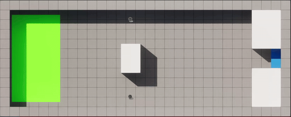

# DynamicCrowdRouting
|                                 |                                 |                                 |
|---------------------------------|---------------------------------|---------------------------------|
|    Description of Real |    Description of OneAgent_Rays |    Description of MovingObs1 |
| .gif)   Description of MovingObs 2 | .gif)   Description of MovingGoal 3 | .gif)   Description of MovingGoal 2 |
| .gif)   Description of MovingGoal 1 |    Description of MiddleBlock |    Description of Lane |

<table>
  <tr>
    <!-- First Image and Description -->
    <td align="center">
      <a href="https://drive.google.com/file/d/1mCdjcRqUc-TE6c4OE4SKSzjM2Wq0iK5i/view">
         
        <b>Video 1: Dynamic Goal Movement</b>
      </a>
    </td>
    <!-- Second Image and Description -->
    <td align="center">
      <a href="https://drive.google.com/file/d/1qmMiXIci0RVm7msLzIWMI6Qjqhg3B18o/view">
         
        <b>Video 2: Moving Obstacles</b>
      </a>
    </td>
  </tr>
</table>

