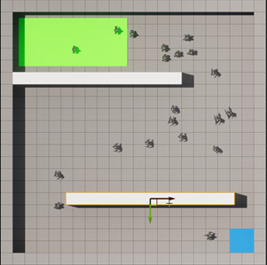

# DynamicCrowdRouting

 <!-- Center the entire block -->
  <!-- First image and description -->
  

    
     
    Video 1: Dynamic Goal Movement
  

  <!-- Second image and description -->
  

    
     
    Video 2: Moving Obstacles
  

