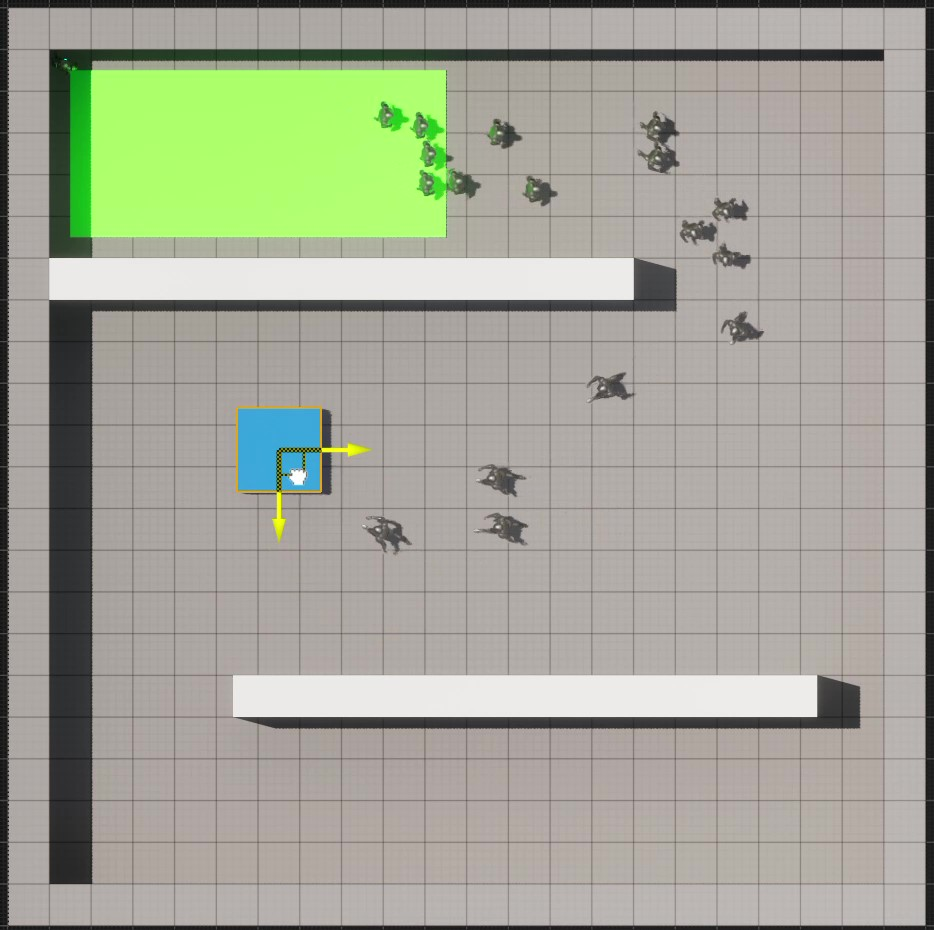

# DynamicCrowdRouting

<table>
  <tr>
    <td> Description of GIF 1</td>
    <td> Description of GIF 2</td>
    <td> Description of GIF 3</td>
  </tr>
  <tr>
    <td> Description of GIF 4</td>
    <td colspan="2"> Description of GIF 5</td>
  </tr>
</table>

<table>
  <tr>
    <!-- First Image and Description -->
    <td align="center">
      <a href="https://drive.google.com/file/d/1mCdjcRqUc-TE6c4OE4SKSzjM2Wq0iK5i/view">
         
        <b>Video 1: Dynamic Goal Movement</b>
      </a>
    </td>
    <!-- Second Image and Description -->
    <td align="center">
      <a href="https://drive.google.com/file/d/1qmMiXIci0RVm7msLzIWMI6Qjqhg3B18o/view">
         
        <b>Video 2: Moving Obstacles</b>
      </a>
    </td>
  </tr>
</table>

